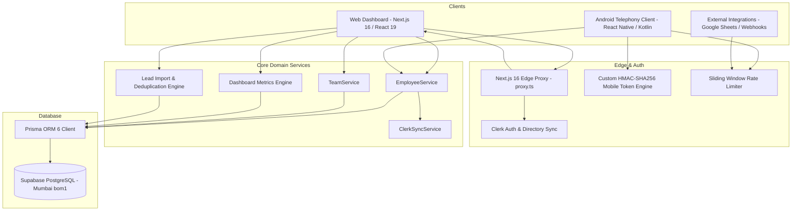

# HEEYAKU CRM & Telephony Ecosystem — Codebase Audit & Function Dictionary

> **Comprehensive Technical Audit, Architecture Graph, Security Ledger, and Function-by-Function Reference**  
> Covering 100% of the Web Application (Next.js 16, React 19, Prisma ORM 6, PostgreSQL/Supabase, Clerk Auth, TailwindCSS v4, Server Actions) and Mobile Telephony Client (React Native Android Bare, Kotlin Telephony Native Modules, Offline Telemetry Queues).

---

## 1. Executive System Architecture

The **HEEYAKU Platform** is a dual-client admissions and enterprise sales telephony CRM designed for high-velocity outbound calling, lead distribution, and real-time talk-time analytics.

---

## 2. Security & Role-Based Access Control (RBAC) Matrix

HEEYAKU enforces strict hierarchical access control with a fail-closed model:

| Role | Scope & Permissions | Key Restrictions |
| :--- | :--- | :--- |
| **CEO** | Global Organization. Full permissions across all staff, squads, leads, exports, and executive metrics. | Account defined in `.env` (`ADMIN_EMAIL`), cannot be edited or deleted via UI. |
| **HR** | Human Resources. Can onboard/edit/delete BDAs and Team Leads, create and manage squads. | Cannot modify CEO accounts; cannot assign or manage sales leads; cannot delete other HR admins. |
| **TEAM_LEAD** | Squad Leader. Manages assigned squad's BDAs, imports/assigns squad leads, views squad leaderboard. | Isolated to their assigned squad; cannot create or delete employee accounts; cannot access other squads. |
| **BDA** | Business Development Associate. Mobile call tracker client, assigned leads dialer, disposition gates. | Mobile access only; can only view and dial leads assigned to their employee ID. |

---

## 3. Exhaustive Function Dictionary

### Module A: Employee & Credential Domain Services ([`lib/employee/employee.service.ts`](file:///c:/Users/sibas/OneDrive/Desktop/Heeyaku%20Project/heeyaku/lib/employee/employee.service.ts))

#### 1. `EmployeeService.createEmployee(input: CreateEmployeeInput, callerRole: Role)`
- **Purpose**: Provisions a new staff member (BDA, Team Lead, or HR) in both PostgreSQL and Clerk, issues an alphanumeric employee ID (`EMP-XXXX`), and generates a secure 10-character temporary password.
- **Parameters**:
  - `input.name` (`string`): Full display name of the staff member (min 2 chars).
  - `input.email` (`string`): Valid email address used for login and notifications.
  - `input.phoneNumber` (`string`): 10-digit telephone number validated via `zodPhoneNumberSchema`.
  - `input.role` (`'BDA' | 'TEAM_LEAD' | 'HR'`): Target system role.
  - `input.teamId` (`string | null | undefined`): Optional squad ID to assign the employee to.
  - `input.teamLeadId` (`string | null | undefined`): Optional Team Lead ID whose squad the employee inherits.
  - `input.team` (`string | undefined`): Optional fallback squad label.
  - `input.notes` (`string | undefined`): Optional administrative notes.
  - `callerRole` (`Role`): Role of the executing user (enforces HR vs CEO rules).
- **Returns**: `Promise<EmployeeCreationResult>` (`{ id, employeeCode, name, email, role, tempPassword }`).
- **Security & Validation**:
  - Throws if email belongs to the Root CEO in `.env`.
  - Throws if `role === 'HR'` and `callerRole !== Role.CEO`.
  - Throws if email already exists in database.
  - Hashes temporary password using bcrypt (10 rounds).
  - Synchronously invokes `ClerkSyncService.provisionUser`.

#### 2. `EmployeeService.updateEmployee(input: UpdateEmployeeInput, callerRole: Role)`
- **Purpose**: Modifies an existing employee profile, role, phone number, or squad assignment while enforcing organizational boundaries.
- **Parameters**:
  - `input.id` (`string`): Target employee database ID.
  - `input.name`, `input.email`, `input.phoneNumber`, `input.role`, `input.teamId`, `input.teamLeadId`, `input.team`, `input.notes`.
  - `callerRole` (`Role`): Role of caller.
- **Returns**: `Promise<void>`.
- **Throws**:
  - If attempting to modify Root CEO accounts.
  - If HR attempts to modify another HR administrator or promote anyone to HR.
  - If email is taken by another record.

#### 3. `EmployeeService.resetPassword(employeeId: string, callerRole: Role)`
- **Purpose**: Generates a new cryptographically random temporary password, updates the PostgreSQL bcrypt hash, and pushes the new password to Clerk.
- **Parameters**:
  - `employeeId` (`string`): Target employee ID.
  - `callerRole` (`Role`): Role of caller.
- **Returns**: `Promise<PasswordResetResult>` (`{ tempPassword, employeeCode }`).

#### 4. `EmployeeService.deleteEmployee(employeeId: string, callerId: string | undefined, callerRole: Role)`
- **Purpose**: Permanently removes an employee account, unassigns all associated leads back to the pool, unlinks squad leadership, and purges the Clerk user.
- **Parameters**:
  - `employeeId` (`string`): Target employee ID.
  - `callerId` (`string | undefined`): ID of caller (blocks self-deletion).
  - `callerRole` (`Role`): Role of caller.
- **Returns**: `Promise<void>`.

#### 5. `EmployeeService.toggleStatus(employeeId: string, callerRole: Role)`
- **Purpose**: Inverts the active state (`isActive = !isActive`) of an employee account. Deactivated accounts cannot log in or receive lead allocations.
- **Parameters**:
  - `employeeId` (`string`): Target employee ID.
  - `callerRole` (`Role`): Role of caller.
- **Returns**: `Promise<boolean>`: New `isActive` status.

---

### Module B: Squad & Team Domain Services ([`lib/team/team.service.ts`](file:///c:/Users/sibas/OneDrive/Desktop/Heeyaku%20Project/heeyaku/lib/team/team.service.ts))

#### 6. `TeamService.createTeam(input: { name, description?, colorTag?, teamLeadId? })`
- **Purpose**: Creates a new squad in PostgreSQL and optionally promotes and assigns an initial Team Lead.
- **Parameters**:
  - `name` (`string`): Squad name (case-insensitive uniqueness enforced).
  - `description` (`string` | optional): Operational description or target focus.
  - `colorTag` (`string` | optional): Hex color code for UI badges (defaults to `#2563EB`).
  - `teamLeadId` (`string` | optional): Employee ID appointed to lead this squad.
- **Returns**: `Promise<{ id: string; name: string }>`.

#### 7. `TeamService.updateTeam(input: UpdateTeamInput)`
- **Purpose**: Updates squad name, description, badge color, and handles Team Lead promotion/transfer. Cascades squad name changes to assigned member employees.
- **Parameters**: `input: { id, name, description?, colorTag?, teamLeadId? }`.
- **Returns**: `Promise<{ id: string; name: string }>`.

#### 8. `TeamService.addBdasToTeam(teamId: string, employeeIds: string[])`
- **Purpose**: Bulk transfers BDAs into a target squad, updating both `teamId` and legacy `team` fields.
- **Parameters**:
  - `teamId` (`string`): Target squad ID.
  - `employeeIds` (`string[]`): Array of employee IDs to transfer.
- **Returns**: `Promise<number>`: Count of updated employees.

#### 9. `TeamService.removeBdaFromTeam(teamId: string, employeeId: string)`
- **Purpose**: Removes a BDA from their squad, reassigning them to the `'General'` squad with `teamId = null`.
- **Parameters**: `teamId: string`, `employeeId: string`.
- **Returns**: `Promise<void>`.

#### 10. `TeamService.deleteTeam(teamId: string)`
- **Purpose**: Dissolves a squad safely. Unlinks assigned leads (`teamId = null`), resets member employees to `'General'`, and deletes the Team row.
- **Parameters**: `teamId: string`.
- **Returns**: `Promise<void>`.

#### 11. `TeamService.fetchAvailableBdas(teamId: string)`
- **Purpose**: Queries active BDAs not currently members of the target squad for squad membership dialogs.
- **Parameters**: `teamId: string`.
- **Returns**: `Promise<CandidateBdaItem[]>`.

#### 12. `TeamService.fetchActiveTeamLeads()`
- **Purpose**: Queries all active staff with role `TEAM_LEAD` for leadership selector dropdowns.
- **Parameters**: None.
- **Returns**: `Promise<TeamLeadOption[]>`.

---

### Module C: Clerk Directory Sync ([`lib/auth/clerk-sync.ts`](file:///c:/Users/sibas/OneDrive/Desktop/Heeyaku%20Project/heeyaku/lib/auth/clerk-sync.ts))

#### 13. `ClerkSyncService.provisionUser(input: ClerkCreateUserInput)`
- **Purpose**: Pushes a new staff member account into Clerk's user directory via Clerk Backend SDK (`clerkClient()`). If user already exists by email, updates their password and names.
- **Parameters**: `input: { email, password, name, employeeCode? }`.
- **Returns**: `Promise<string | null>`: Clerk user ID or null on failure (fails gracefully to preserve local DB state).

#### 14. `ClerkSyncService.updatePassword(clerkUserId: string, newPassword: string)`
- **Purpose**: Synchronizes an administrative password reset to Clerk.
- **Parameters**: `clerkUserId: string`, `newPassword: string`.
- **Returns**: `Promise<boolean>`.

#### 15. `ClerkSyncService.updateProfile(clerkUserId: string, name: string)`
- **Purpose**: Updates staff member's `firstName` and `lastName` in Clerk.
- **Parameters**: `clerkUserId: string`, `name: string`.
- **Returns**: `Promise<boolean>`.

#### 16. `ClerkSyncService.deleteUser(clerkUserId: string)`
- **Purpose**: Permanently deletes a staff member from Clerk directory upon deletion in CRM.
- **Parameters**: `clerkUserId: string`.
- **Returns**: `Promise<boolean>`.

---

### Module D: RBAC & Authentication Engine ([`lib/auth/rbac.ts`](file:///c:/Users/sibas/OneDrive/Desktop/Heeyaku%20Project/heeyaku/lib/auth/rbac.ts))

#### 17. `getAuthenticatedUser()`
- **Purpose**: Resolves the calling user from Clerk session (`auth()`, `currentUser()`) and PostgreSQL. Checks for Root CEO status in `ADMIN_EMAIL`, respects CEO role simulation cookie (`heeyaku_simulated_role`), verifies active status, and caches session in-memory for 5 minutes.
- **Parameters**: None (reads headers and cookies).
- **Returns**: `Promise<AuthenticatedUser | null>`.

#### 18. `assertAuthenticatedUser()`
- **Purpose**: Enforces mandatory authentication. Calls `getAuthenticatedUser()` and throws `AuthorizationError` (403) if unauthenticated.
- **Parameters**: None.
- **Returns**: `Promise<AuthenticatedUser>`.

#### 19. Permission Check Helpers
- `canManageEmployees(role: Role): boolean` → True if CEO or HR.
- `canDeleteEmployee(role: Role): boolean` → True if CEO or HR.
- `canManageLeads(role: Role): boolean` → True if CEO or TEAM_LEAD.
- `canAssignLeads(role: Role): boolean` → True if CEO or TEAM_LEAD.
- `canExportLeads(role: Role): boolean` → True if CEO or TEAM_LEAD.
- `canViewExecutive(role: Role): boolean` → True if CEO.
- `canViewTeamsBoard(role: Role): boolean` → True if CEO or TEAM_LEAD.
- `canManageTeams(role: Role): boolean` → True if CEO or HR.
- `isAllowedCeoEmail(email?: string | null): boolean` → Validates against `ADMIN_EMAIL` in `.env`.
- `invalidateUserSessionCache(userId?: string): void` → Clears cached session.

---

### Module E: Mobile Token & Security Utilities

#### 20. `signEmployeeToken(data, expiresInDays = 30)` ([`lib/auth/employee-token.ts`](file:///c:/Users/sibas/OneDrive/Desktop/Heeyaku%20Project/heeyaku/lib/auth/employee-token.ts))
- **Purpose**: Generates a standard URL-safe HMAC-SHA256 (HS256) JWT for Android mobile app authenticated sessions.
- **Parameters**: `data: Omit<EmployeeTokenPayload, 'exp'>`, `expiresInDays?: number`.
- **Returns**: `string` (`header.payload.signature`).

#### 21. `verifyEmployeeToken(token: string)` ([`lib/auth/employee-token.ts`](file:///c:/Users/sibas/OneDrive/Desktop/Heeyaku%20Project/heeyaku/lib/auth/employee-token.ts))
- **Purpose**: Verifies an employee session token in constant time using `crypto.timingSafeEqual` and checks expiration.
- **Parameters**: `token: string`.
- **Returns**: `EmployeeTokenPayload | null`.

#### 22. `verifyExternalApiKey(req: NextRequest)` ([`lib/auth/external-api.ts`](file:///c:/Users/sibas/OneDrive/Desktop/Heeyaku%20Project/heeyaku/lib/auth/external-api.ts))
- **Purpose**: Validates incoming API keys for Google Sheets and webhooks using constant-time comparison against `EXTERNAL_INGESTION_API_KEY`.
- **Parameters**: `req: NextRequest` (inspects `x-api-key`, `Authorization: Bearer`, and fallback `?apiKey=`).
- **Returns**: `boolean`.

#### 23. `checkRateLimit(key: string, options)` ([`lib/security/rate-limit.ts`](file:///c:/Users/sibas/OneDrive/Desktop/Heeyaku%20Project/heeyaku/lib/security/rate-limit.ts))
- **Purpose**: In-memory sliding-window rate limiter protecting login and sensitive endpoints.
- **Parameters**: `key: string`, `options: { windowMs: number, maxAttempts: number }`.
- **Returns**: `RateLimitResult` (`{ allowed, remaining, resetSeconds }`).

#### 24. `generateRandomPassword(length = 10)` ([`lib/crypto/passwords.ts`](file:///c:/Users/sibas/OneDrive/Desktop/Heeyaku%20Project/heeyaku/lib/crypto/passwords.ts))
- **Purpose**: Generates a cryptographically random, unambiguous password using `crypto.randomInt` and Fisher-Yates shuffle.
- **Parameters**: `length?: number`.
- **Returns**: `string`.

#### 25. `hashPassword(plainText: string)` / `verifyPassword(plainText, hash)` ([`lib/crypto/passwords.ts`](file:///c:/Users/sibas/OneDrive/Desktop/Heeyaku%20Project/heeyaku/lib/crypto/passwords.ts))
- **Purpose**: Bcrypt password hashing (10 salt rounds) and comparison.

---

### Module F: Lead Pipeline & Assignment Actions ([`app/admin/leads/`](file:///c:/Users/sibas/OneDrive/Desktop/Heeyaku%20Project/heeyaku/app/admin/leads/))

#### 26. `createLeadAction(input: unknown)` ([`actions.ts`](file:///c:/Users/sibas/OneDrive/Desktop/Heeyaku%20Project/heeyaku/app/admin/leads/actions.ts))
- **Purpose**: Server action creating a lead manually with auto-generated sequential lead code (`LD-XXXXX`). Scoped to Team Lead squad if executed by a Team Lead.
- **Parameters**: `input` parsed against `CreateLeadSchema` (`name`, `phoneNumber`, `email?`, `company?`, `source?`, `status?`, `notes?`, `assignedEmployeeId?`).
- **Returns**: `Promise<ActionResponse<{ id: string; leadCode: string }>>`.

#### 27. `updateLeadAction(input: unknown)` ([`actions.ts`](file:///c:/Users/sibas/OneDrive/Desktop/Heeyaku%20Project/heeyaku/app/admin/leads/actions.ts))
- **Purpose**: Server action updating lead details, status transitions (`NEW` ↔ `ASSIGNED`), and reassignment. Enforces squad boundaries for Team Leads.
- **Parameters**: `input` parsed against `UpdateLeadSchema`.
- **Returns**: `Promise<ActionResponse>`.

#### 28. `deleteLeadAction(id: string)` ([`actions.ts`](file:///c:/Users/sibas/OneDrive/Desktop/Heeyaku%20Project/heeyaku/app/admin/leads/actions.ts))
- **Purpose**: Server action deleting a lead. Enforces squad boundaries for Team Leads.
- **Parameters**: `id: string`.
- **Returns**: `Promise<ActionResponse>`.

#### 29. `assignLeadsAction(input: unknown)` ([`assignment-actions.ts`](file:///c:/Users/sibas/OneDrive/Desktop/Heeyaku%20Project/heeyaku/app/admin/leads/assignment-actions.ts))
- **Purpose**: Atomically assigns selected leads to an employee inside a PostgreSQL `$transaction`. Leads in `NEW` advance to `ASSIGNED`; advanced pipeline stages are preserved.
- **Parameters**: `input` parsed against `AssignLeadsSchema` (`{ leadIds: string[], employeeId: string }`).
- **Returns**: `Promise<ActionResponse<{ count, employeeName, employeeCode }>>`.

#### 30. `unassignLeadsAction(input: unknown)` ([`assignment-actions.ts`](file:///c:/Users/sibas/OneDrive/Desktop/Heeyaku%20Project/heeyaku/app/admin/leads/assignment-actions.ts))
- **Purpose**: Atomically unassigns selected leads. Leads in `ASSIGNED` revert to `NEW` pool; advanced stages retain status while clearing employee association.
- **Parameters**: `input` parsed against `UnassignLeadsSchema` (`{ leadIds: string[] }`).
- **Returns**: `Promise<ActionResponse<{ count: number }>>`.

#### 31. `autoAssignLeadsAction(input: unknown)` ([`assignment-actions.ts`](file:///c:/Users/sibas/OneDrive/Desktop/Heeyaku%20Project/heeyaku/app/admin/leads/assignment-actions.ts))
- **Purpose**: Distributes unassigned leads to a designated team of employees using either round-robin (`EVENLY`) or block (`SEQUENTIAL`) distribution inside a transaction.
- **Parameters**: `input` parsed against `AutoAssignLeadsSchema` (`{ employeeIds, assignAll, leadsPerEmployee?, distributionMethod }`).
- **Returns**: `Promise<ActionResponse<{ assignedCount: number; distribution: Record<string, number> }>>`.

---

### Module G: Import & Ingestion Engine ([`app/admin/leads/import-actions.ts`](file:///c:/Users/sibas/OneDrive/Desktop/Heeyaku%20Project/heeyaku/app/admin/leads/import-actions.ts), [`lib/lead/import-parser.ts`](file:///c:/Users/sibas/OneDrive/Desktop/Heeyaku%20Project/heeyaku/lib/lead/import-parser.ts))

#### 32. `validateAndPreviewImportAction(rows)`
- **Purpose**: Server action validating uploaded spreadsheet rows, normalizing 10-digit phone numbers, and executing two-phase deduplication: in-file check and chunked database check (2,000 numbers/batch).
- **Parameters**: `rows: Array<{ rowNumber, name, phoneNumber, email?, company?, source?, notes? }>`.
- **Returns**: `Promise<ActionResponse<ImportPreviewResult>>` (`{ totalRows, validRows, duplicates, invalidRows }`).

#### 33. `executeImportAction(input)`
- **Purpose**: Inserts valid leads into Supabase in chunked batches of 1,000 records with sequential lead codes (`LD-XXXXX`), optional assignment, and squad scoping.
- **Parameters**: `input: { leads: PreparedImportLead[], assignedEmployeeId?: string }`.
- **Returns**: `Promise<ActionResponse<{ insertedCount: number, assignedEmployeeName?: string }>>`.

#### 34. `fetchGoogleSheetDataAction(sheetUrl: string)`
- **Purpose**: Fetches public Google Sheet data via CSV export with strict SSRF defense (HTTPS only, `docs.google.com` hostname validation, trusted redirect verification), parses via PapaParse, and returns headers and rows.
- **Parameters**: `sheetUrl: string`.
- **Returns**: `Promise<ActionResponse<FetchGoogleSheetResult>>`.

#### 35. `parseGoogleSheetUrl(url: string)`
- **Purpose**: Translates any Google Sheets edit, view, share, or published web URL into a direct CSV export endpoint.
- **Parameters**: `url: string`.
- **Returns**: `{ exportUrl: string; sheetIdentifier: string } | { error: string }`.

#### 36. `parseImportFile(file: File)` / `parseImportCsvText(text: string)`
- **Purpose**: Parses browser `File` objects (.csv, .xlsx, .xls) and raw clipboard text into headers and row JSON arrays.
- **Parameters**: `file: File` / `text: string`.
- **Returns**: `Promise<{ headers: string[], rows: RawImportRow[] }>`.

#### 37. `autoDetectColumnMapping(headers: string[])`
- **Purpose**: Heuristically matches user column headers to CRM fields (`nameCol`, `phoneCol`, `emailCol`, `companyCol`, `sourceCol`, `notesCol`).
- **Parameters**: `headers: string[]`.
- **Returns**: `ColumnMapping`.

---

### Module H: API Route Handlers ([`app/api/`](file:///c:/Users/sibas/OneDrive/Desktop/Heeyaku%20Project/heeyaku/app/api/))

#### 38. `POST /api/employee/auth/login`
- **Purpose**: Mobile employee login handler. Validates identifier (employeeCode `EMP-XXXX` or email) and password, applies IP and account rate limiting (5 attempts / 2 min), and returns a 30-day HMAC-SHA256 JWT.
- **Parameters**: JSON body `{ identifier: string, password: string }`.
- **Response**: `{ success: true, token: string, employee: { id, employeeCode, name, email, phoneNumber, team } }`.

#### 39. `GET /api/employee/auth/me`
- **Purpose**: Validates Bearer JWT token and returns employee profile, active squad, and session status.
- **Headers**: `Authorization: Bearer <token>`.

#### 40. `GET /api/employee/leads`
- **Purpose**: Returns leads assigned to the authenticated employee for mobile dialer CRM tab.
- **Headers**: `Authorization: Bearer <token>`.

#### 41. `POST /api/employee/leads/[leadId]/disposition`
- **Purpose**: Mandatory post-call disposition gate. Updates lead status (e.g. `INTERESTED`, `CALL_BACK`, `FOLLOW_UP`), remarks, and optional WhatsApp redirection.
- **Parameters**: URL param `leadId`, JSON body `{ status: LeadStatus, notes?: string }`.

#### 42. `POST /api/employee/calls/sync`
- **Purpose**: Mobile telemetry synchronization. Receives batch call logs from Android device, performs N+1 batch lead and call deduplication, saves records to `CallLog`, updates lead `lastContactedAt`, and advances lead status if connected.
- **Parameters**: JSON body `{ calls: Array<{ phoneNumber, durationSeconds, connected, callType, startedAt, endedAt, notes? }> }`.

#### 43. `GET /api/employee/analytics`
- **Purpose**: Computes personal telephony KPIs for the mobile employee: today's calls, total talk time, connection rate, and monthly stats.

#### 44. `POST /api/v1/leads/ingest`
- **Purpose**: External webhook endpoint for CRM intake (Zapier, Facebook Lead Ads, Google Forms). Authenticated via `x-api-key` with constant-time verification. Normalizes phone numbers and creates/assigns lead.

#### 45. `POST /api/v1/integrations/google-sheets/sync`
- **Purpose**: Automated Google Sheets polling and webhook sync. Compares `sheetHash` in `SyncMeta` to avoid redundant imports.

#### 46. `GET /api/admin/leads/export`
- **Purpose**: Streaming lead export. Generates CSV or XLSX with formula injection protection and download headers.

---

### Module I: Telephony & Mobile Client Architecture ([`CallTrackerAndroid/`](file:///c:/Users/sibas/OneDrive/Desktop/Heeyaku%20Project/heeyaku/CallTrackerAndroid/))

#### 47. `useCallTracker()`
- **Purpose**: Master React Native hook managing Android telephony state, `PhoneStateListener`, call timer, connected status determination (`OFFHOOK`), and post-call disposition modal trigger.

#### 48. `offlineQueue`
- **Purpose**: Resilient offline call log queue backed by native SharedPreferences. Flushes queued records to `/api/employee/calls/sync` upon network reconnection or app foreground resume.

#### 49. `assignedLeadsService`
- **Purpose**: Caches assigned leads locally in the mobile app, providing instant offline search and one-tap dialing.

---

## 4. Verification & Integrity Checklist

- [x] **Next.js 16 Compatibility**: Root proxy configured in [`proxy.ts`](file:///c:/Users/sibas/OneDrive/Desktop/Heeyaku%20Project/heeyaku/proxy.ts) (Edge runtime, Clerk proxy, route matchers).
- [x] **Zero TypeScript Errors**: Verified clean build via `npx tsc --noEmit` (exit code 0).
- [x] **Prisma & Database Consistency**: Composite indexes on `[updatedAt]`, `[assignedEmployeeId, status]`, `[phoneNumber, connected]`.
- [x] **Security Hardening**:
  - Root CEO email locked via `ADMIN_EMAIL` in `.env`.
  - Constant-time HMAC & API key verification (`crypto.timingSafeEqual`).
  - Sliding-window rate limiters on all authentication endpoints.
  - CSV/Spreadsheet formula injection neutralization (`sanitizeCell`).
  - Server-side memory caching on metrics, chunks, and sessions.
